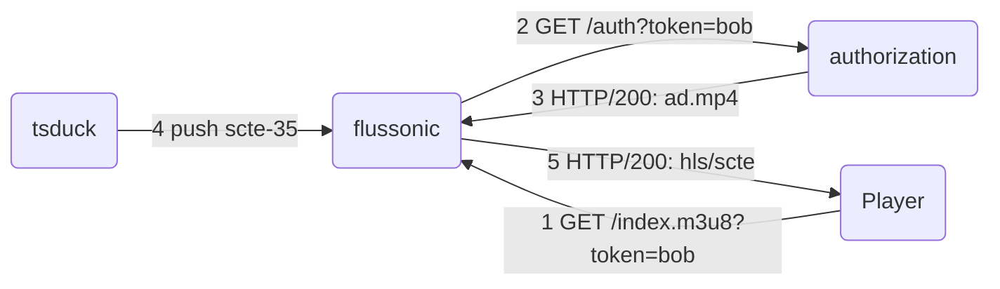

This is a simple illustration of Flussonic's server-side ad insertion (SSAI) using SCTE-35 markers. A more detailed description can be found in the [documentation](https://flussonic.com/doc/iptv-ads-technologies/).

**How it works**:


1. Сlient requests HLS playlist with `token=bob`
2. Flussonic requests auth backend with `token=bob`
3. Auth backend authorizes the client, and returns a list of ad videos for insertion. The auth backend's response:
```json
{
   "ad_inject":{
      "v":2,
      "preroll":[
         "vod/ad.mp4"
      ],
      "midroll_insert_by":"splicing",
      "midroll":[
         "vod/ad.mp4"
      ]
   }
}
```
`preroll` is the ad video at the start of playback, and `midroll` is the ad video that will be inserted into the HLS stream when SCTE-35 splice_insert appears on input.

4. SCTE-35 splice_insert event arrives
5. Flussonic packages and inserts ad videos into the main HLS stream using information from the SCTE-35 event. Сlient observes in the player seamless switching between main content and ad.

It is important to mention that Flussonic packages segments in such a way that the URIs of segments with ads are indistinguishable from the URIs of segments with the main content:
```
#EXTM3U
#EXT-X-TARGETDURATION:2
#EXT-X-VERSION:3
#EXT-X-MEDIA-SEQUENCE:20290
#EXT-X-PROGRAM-DATE-TIME:2024-03-18T19:30:59.920Z
#EXTINF:2.000,
2024/03/18/19/30/59-02000.ts
#EXTINF:2.000,
2024/03/18/19/31/01-02000.ts <-- main content
#EXTINF:2.000,
2024/03/18/19/31/03-02000.ts <-- ad content
#EXTINF:2.000,
2024/03/18/19/31/05-02000.ts
```
The ad blocking using a plugin becomes very diffcult and unprofitable because requires decoding the video in order to find the ad.


**Video pipeline**:


* Flussonic uses `rick.mp4` file in a loop, and pushes udp/ts to `udp://224.2.2.2:2222`:
```
stream flusai-input {
  input file://vod/rick.mp4;
  push udp://224.2.2.2:2222;
}
```
This is the source of the main content
* Tsduck ingests `udp://224.2.2.2:2222`, generates the separate SCTE-35 TS PID, injects splice_insert event every 60 seconds and pushes stream to `udp://224.2.2.2:3333`:
```
tsp --add-input-stuffing 1/10 -I ip udp://224.2.2.2:2222 -P pmt --add-pid 301/0x86 -P spliceinject --inject-interval 2000 --service 0x3e8 --file splice.xml -O ip udp://224.2.2.2:3333
```
This is just a way to create a stream with SCTE-35 events. It is possible to use any source with SCTE-35 events.
* Flussonic ingests `udp://224.2.2.2:3333`, parses SCTE-35 events, transcodes to MBR stream and packages the HLS:
```
stream flusai {
  input udp://224.2.2.2:3333;
  on_play http://localhost:8888/vod/ssai.json;
  segment_duration 2;
  transcoder deviceid=0 gop=50 hw=cpu vb=2700k bframes=0 profile=baseline size=1920x1080:fit:#000000 vb=2000k bframes=0 profile=baseline size=1280x720:fit:#000000 vb=1000k bframes=0 profile=baseline size=640x350:fit:#000000 deinterlace=true deinterlace_rate=frame ab=128k;
}
```

**Prerequisites**:
* docker и docker-compose installed
* For tsduck, you can use custom [image](https://hub.docker.com/repository/docker/makaroshkj/ssai-duck/general) with `spliceinject` installed
* Flussonic offical [image](https://hub.docker.com/r/flussonic/flussonic)

**How to run**:
* Paste your `LICENSE_KEY` in the `docker-compose.yml`
* Run docker compose
```
docker compose up -d
```
* Play HLS stream `http://localhost:8888/flusai/index.m3u8`

Enjoy seamless switching between main content and ad video :)


